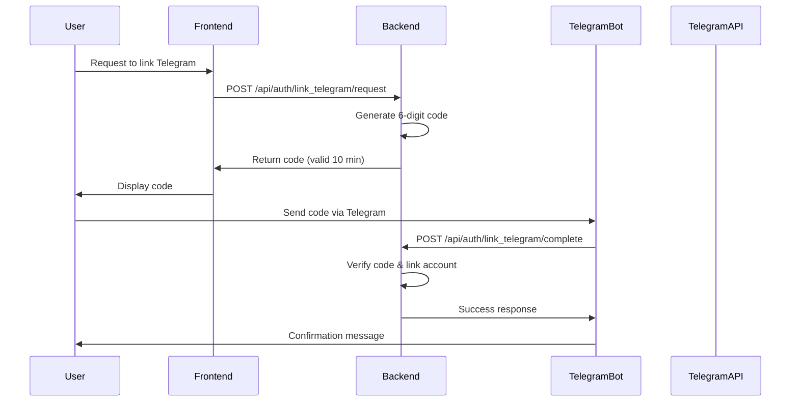
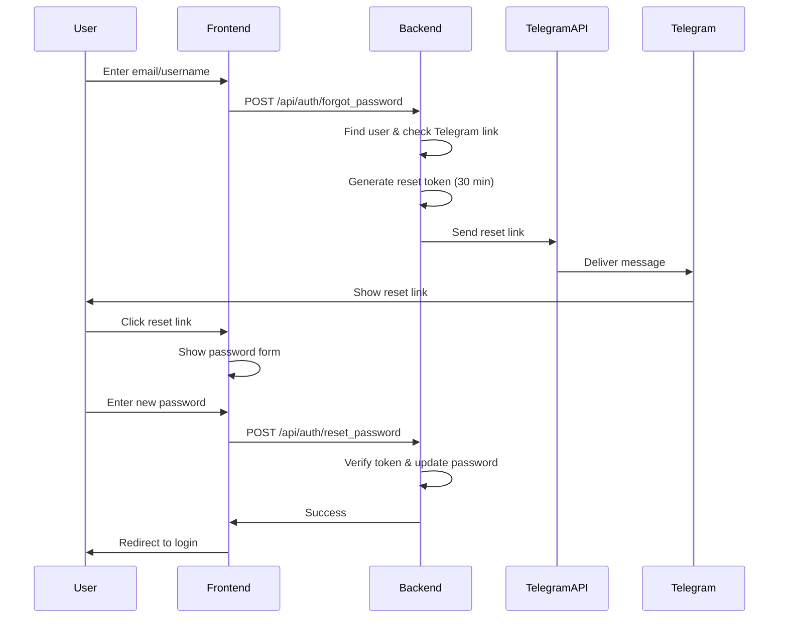

# Telegram Password Recovery System

## Overview

This document describes the complete password recovery system using Telegram Bot API for secure notification delivery. The system allows users to link their Telegram accounts and receive password reset links via Telegram messages.

## Architecture

### Components

1. **Token Management** (`backend/src/token_utils.py`)
   - Secure token generation using `itsdangerous.URLSafeTimedSerializer`
   - Token lifetime: 30 minutes (1800 seconds)
   - Tokens are signed and time-limited

2. **Telegram Integration** (`backend/src/telegram_utils.py`)
   - Direct HTTP POST integration with Telegram Bot API
   - Message formatting with HTML support
   - Error handling and timeout management

3. **Database Models** (`backend/src/models/user.py`)
   - `User.telegram_chat_id`: Nullable field for Telegram chat ID
   - `TelegramLinkCode`: Temporary 6-digit codes for account linking

4. **API Routes** (`backend/src/routes/auth.py`)
   - Four new endpoints for Telegram linking and password recovery

## Setup Instructions

### 1. Environment Variables

Set the following environment variables:

```bash
# Required: Your Telegram Bot Token from @BotFather
export TELEGRAM_BOT_TOKEN="123456789:ABCdefGHIjklMNOpqrsTUVwxyz"

# Required: Secret key for internal webhook security
export TELEGRAM_WEBHOOK_SECRET="your-secure-random-secret-here"

# Optional: Frontend URL for password reset links (default: http://localhost:5173)
export FRONTEND_URL="https://yourdomain.com"
```

### 2. Run Database Migration

```bash
cd backend
python migrate_telegram_recovery.py
```

Expected output:
```
Telegram Password Recovery Migration
==================================================
Migrating database at .../backend/src/database/app.db
Adding telegram_chat_id column to users table...
✓ Added telegram_chat_id column
Creating telegram_link_codes table...
✓ Created telegram_link_codes table
Creating indexes...
✓ Created indexes
✓ Database migration completed successfully!

🎉 Migration completed successfully!
```

### 3. Create Telegram Bot

1. Open Telegram and search for [@BotFather](https://t.me/BotFather)
2. Send `/newbot` command
3. Follow instructions to create your bot
4. Copy the bot token provided by BotFather
5. Set `TELEGRAM_BOT_TOKEN` environment variable

### 4. Restart Flask Application

```bash
cd backend/src
python main.py
```

## API Endpoints

### 1. Request Telegram Linking Code

**Endpoint:** `POST /api/auth/link_telegram/request`

**Authentication:** Required (Bearer token)

**Request Body:**
```json
{}
```

**Response (200 OK):**
```json
{
  "success": true,
  "code": "123456",
  "expires_at": "2025-10-23T10:30:00",
  "validity_minutes": 10,
  "message": "Send this code to the AskHole Telegram bot to link your account"
}
```

**Error Responses:**
- `401 Unauthorized`: Not authenticated
- `400 Bad Request`: Telegram already linked

### 2. Complete Telegram Linking

**Endpoint:** `POST /api/auth/link_telegram/complete`

**Authentication:** None (uses secret key for internal security)

**Request Body:**
```json
{
  "code": "123456",
  "telegram_chat_id": "987654321",
  "secret_key": "your-webhook-secret"
}
```

**Response (200 OK):**
```json
{
  "success": true,
  "message": "Telegram account linked successfully",
  "user": {
    "id": 1,
    "username": "john_doe",
    "email": "john@example.com",
    "telegram_linked": true
  }
}
```

**Error Responses:**
- `400 Bad Request`: Invalid or expired code
- `403 Forbidden`: Invalid secret key
- `404 Not Found`: User not found

### 3. Forgot Password (Request Reset)

**Endpoint:** `POST /api/auth/forgot_password`

**Authentication:** None

**Request Body:**
```json
{
  "email": "user@example.com"
}
```
OR
```json
{
  "username": "john_doe"
}
```

**Response (200 OK - Always):**
```json
{
  "success": true,
  "message": "If your account exists and has Telegram linked, you will receive a password reset link."
}
```

**Security Note:** This endpoint always returns success to prevent user enumeration attacks.

### 4. Reset Password (Complete Reset)

**Endpoint:** `POST /api/auth/reset_password`

**Authentication:** None (token-based)

**Request Body:**
```json
{
  "token": "eyJhbGciOiJIUzI1NiIsInR5cCI6IkpXVCJ9...",
  "new_password": "NewSecurePass123"
}
```

**Response (200 OK):**
```json
{
  "success": true,
  "message": "Password has been reset successfully. Please log in with your new password."
}
```

**Error Responses:**
- `400 Bad Request`: Missing fields or weak password
- `401 Unauthorized`: Invalid or expired token

**Password Requirements:**
- Minimum 6 characters
- At least one letter
- At least one number

## Workflow

### Account Linking Flow



### Password Reset Flow



## Security Features

### Token Security
- **Time-limited:** Tokens expire after 30 minutes
- **Signed:** Uses HMAC-SHA256 for signature verification
- **Single-use:** Not enforced at token level, but password change invalidates existing sessions

### Account Linking Security
- **Time-limited codes:** Linking codes expire after 10 minutes
- **One-time use:** Codes can only be used once
- **Secret key protection:** Internal webhook endpoint requires secret key
- **Uniqueness enforcement:** One Telegram account per user

### Password Reset Security
- **User enumeration prevention:** Always returns generic success message
- **Pre-check:** Verifies Telegram account is linked before sending
- **Strong password requirements:** Enforces minimum security standards
- **Session invalidation:** Optionally invalidates all sessions on password reset

## Telegram Message Formatting

### Password Reset Message

```html
<b>🔐 Password Reset Request</b>

Hello <b>john_doe</b>!

You have requested to reset your password. Click the link below to continue:

https://yourdomain.com/reset-password/token_here

⏰ This link will expire in <b>30 minutes</b>.

If you did not request this password reset, please ignore this message.

---
<i>AskHole Security Team</i>
```

### Account Linking Message

```html
<b>🔗 Link Your Telegram Account</b>

Your verification code is:

<code>123456</code>

⏰ This code will expire in <b>10 minutes</b>.

To complete the linking process, send this code to the AskHole bot.

---
<i>AskHole Security Team</i>
```

## Error Handling

### Token Verification Errors

```python
try:
    user = verify_reset_token(token)
except SignatureExpired:
    # Token has expired (> 30 minutes old)
    return 401, "Token expired"
except BadSignature:
    # Token is invalid or tampered
    return 401, "Invalid token"
```

### Telegram API Errors

```python
success, response, error = send_telegram_message(chat_id, message)

if not success:
    # Possible errors:
    # - Bot token not configured
    # - Invalid chat_id
    # - Network timeout
    # - API rate limiting
    logger.error(f"Telegram error: {error}")
```

## Testing

### Manual Testing Script

```python
import requests

BASE_URL = "http://localhost:5000/api/auth"

# 1. Login to get session
login_response = requests.post(f"{BASE_URL}/login", json={
    "username": "testuser",
    "password": "Test123"
})
session_id = login_response.json()["session_id"]

headers = {"Authorization": f"Bearer {session_id}"}

# 2. Request linking code
link_request = requests.post(
    f"{BASE_URL}/link_telegram/request",
    headers=headers
)
code = link_request.json()["code"]
print(f"Linking code: {code}")

# 3. Simulate bot completing link
complete_link = requests.post(
    f"{BASE_URL}/link_telegram/complete",
    json={
        "code": code,
        "telegram_chat_id": "123456789",
        "secret_key": "your-webhook-secret"
    }
)
print(complete_link.json())

# 4. Request password reset
reset_request = requests.post(
    f"{BASE_URL}/forgot_password",
    json={"username": "testuser"}
)
print(reset_request.json())

# 5. Complete password reset (get token from Telegram message)
reset_complete = requests.post(
    f"{BASE_URL}/reset_password",
    json={
        "token": "token_from_telegram",
        "new_password": "NewPass123"
    }
)
print(reset_complete.json())
```

## Deployment Considerations

### Production Environment Variables

```bash
# Production settings
export TELEGRAM_BOT_TOKEN="your-production-bot-token"
export TELEGRAM_WEBHOOK_SECRET="$(openssl rand -hex 32)"
export FRONTEND_URL="https://app.yourdomain.com"
export FLASK_ENV="production"
```

### Nginx Configuration (Optional)

If using Nginx as reverse proxy:

```nginx
location /api/auth/link_telegram/complete {
    # Restrict to internal calls only
    allow 127.0.0.1;
    deny all;

    proxy_pass http://localhost:5000;
    proxy_set_header Host $host;
    proxy_set_header X-Real-IP $remote_addr;
}
```

### Rate Limiting

Consider implementing rate limiting on password reset endpoints:

```python
from flask_limiter import Limiter

limiter = Limiter(app, key_func=get_remote_address)

@auth_bp.route('/forgot_password', methods=['POST'])
@limiter.limit("3 per hour")
def forgot_password():
    # ...
```

## Troubleshooting

### Issue: "Telegram Bot Token not configured"

**Solution:** Set `TELEGRAM_BOT_TOKEN` environment variable and restart Flask.

### Issue: "Invalid or already used code"

**Solution:** Codes expire after 10 minutes. Request a new code.

### Issue: "This Telegram account is already linked to another user"

**Solution:** Each Telegram account can only be linked to one user. Unlink from other account first.

### Issue: Token verification fails

**Solution:**
- Check token hasn't expired (30 minutes)
- Verify `SECRET_KEY` hasn't changed in Flask config
- Ensure token wasn't tampered with

## Future Enhancements

1. **Telegram Bot Implementation**
   - Create actual Telegram bot to automate linking process
   - Add commands: `/start`, `/link`, `/unlink`, `/help`

2. **Two-Factor Authentication**
   - Use Telegram as 2FA method
   - Send verification codes on login

3. **Notification System**
   - Alert users of suspicious login attempts
   - Notify on password changes

4. **Admin Dashboard**
   - View Telegram linking statistics
   - Manually unlink accounts if needed

## License

This implementation is part of the AskHole project and follows the same MIT license.
